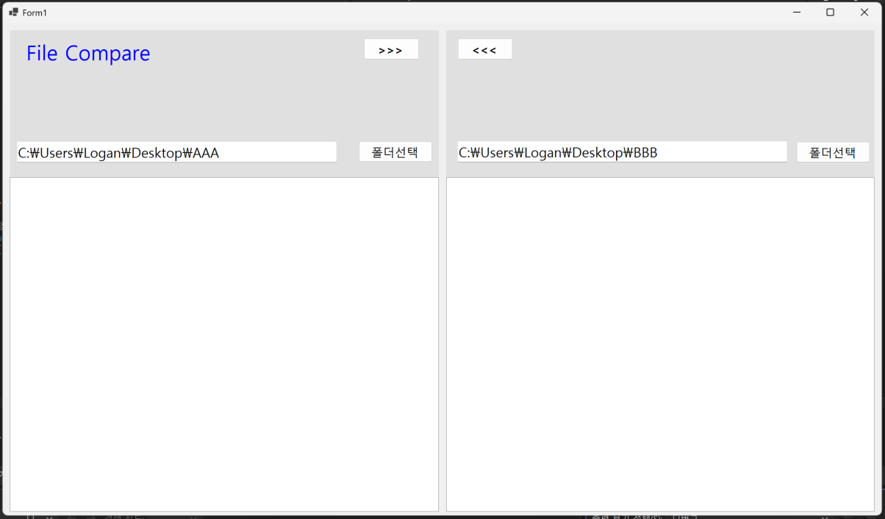
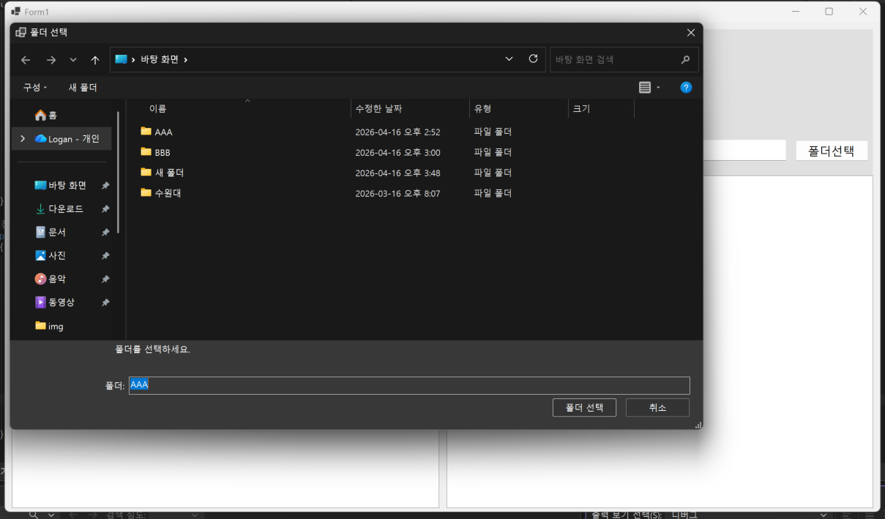
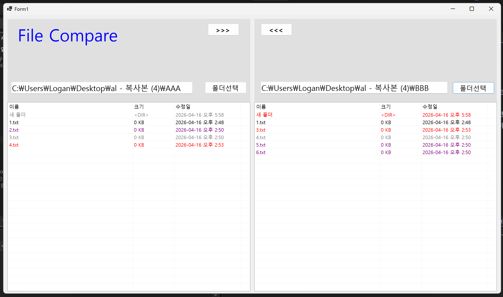
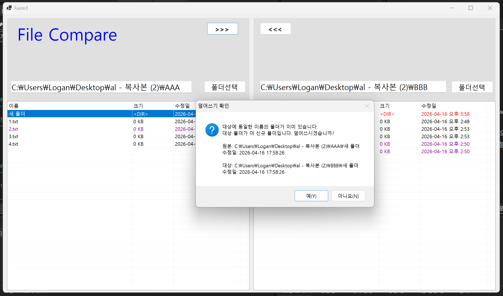
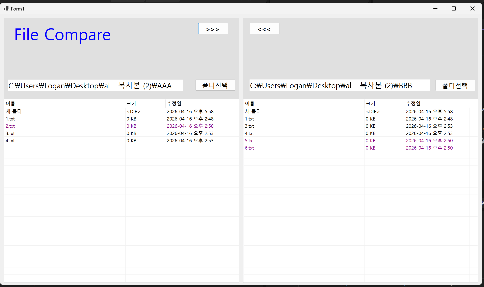
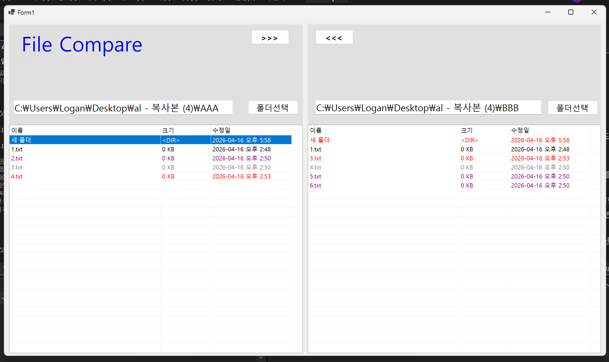
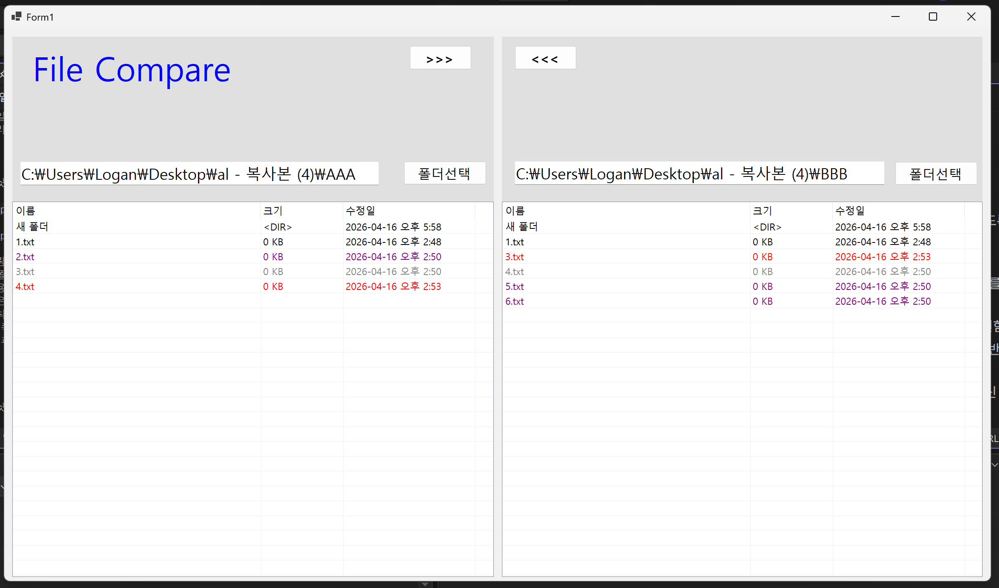

# (C# 코딩) 파일 비교툴
## 개요
- C# 프로그래밍 학습
- 1줄 소개: 두 개의 폴더를 비교하여 파일 목록을 확인하고, 양방향으로 파일을 복사할 수 있는 프로그램
- 사용한 플랫폼: C#, .NET Windows Forms, Visual Studio, GitHub
 
- 사용한 컨트롤: SplitContainer, Panel, Label, TextBox, Button, ListView, FolderBrowserDialog
	
- 사용한 기술과 구현한 기능:
	- Visual Studio를 이용하여 파일 비교 앱 UI 디자인
	- SplitContainer와 Panel을 이용한 좌우 영역 분할 화면 구성
	- FolderBrowserDialog를 이용한 폴더 선택 기능 구현
	- TextBox를 이용한 선택 폴더 경로 표시
	- ListView를 이용한 파일 이름, 크기, 수정일 목록 표시
	- Directory와 FileInfo를 이용한 파일 및 폴더 정보 읽기
	- 파일 비교 결과를 색상으로 구분하여 표시하는 기능 구현
	- 선택한 파일을 반대쪽 폴더로 복사하는 기능 구현
	- 수정 날짜를 비교하여 덮어쓰기 여부를 확인하는 기능 구현
	- 하위폴더까지 포함하여 비교 및 복사하는 기능 구현

## 실행 화면 (과제1)
- 코드의 실행 스크린샷과 구현 내용 설명

- 구현한 내용 (위 그림 참조)
	- 파일 비교 프로그램의 기본 화면을 구성하고, 좌우 영역을 분할하여 각 폴더의 내용을 한눈에 비교할 수 있도록 UI를 설계함
	- 폴더 선택 기능을 구현하여 사용자가 원하는 디렉터리를 직접 선택하고, 선택된 경로가 입력창에 표시되도록 구현함
	
	

## 실행 화면 (과제2)
- 코드의 실행 스크린샷과 구현 내용 설명

- 구현한 내용 (위 그림 참조)
	- 선택한 폴더의 파일 및 하위폴더 목록을 ListView에 표시하여 이름, 크기, 수정일 정보를 확인할 수 있도록 구현함
	- 양쪽 폴더의 파일과 폴더를 이름 및 수정일 기준으로 비교하도록 구현함
	- 비교 결과에 따라 동일 항목, 최신 항목, 오래된 항목, 한쪽에만 존재하는 항목을 색상으로 구분하여 표시함

## 실행 화면 (과제3)
- 코드의 실행 스크린샷과 구현 내용 설명

- 구현한 내용 (위 그림 참조)
	- 왼쪽과 오른쪽 폴더 사이에서 선택한 파일을 반대쪽 폴더로 복사할 수 있도록 구현함
	- 복사 버튼을 이용하여 양방향으로 파일을 이동할 수 있도록 기능을 추가함
	- 대상 폴더에 같은 이름의 파일이 존재하는 경우 수정 날짜를 비교하도록 구현함
	- 오래된 파일을 최신 파일로 덮어쓰는 상황에서는 확인 메시지창을 표시하여 사용자 확인 후 복사가 진행되도록 구현함
	- 파일 복사 후 양쪽 폴더의 목록이 다시 갱신되도록 하여 변경된 결과를 바로 확인할 수 있도록 구현함
	- 최신파일을 과거파일로 덮어씌우는 경우 에러 메시지창이 표시되도록 구현함

## 실행 화면 (과제4)
- 코드의 실행 스크린샷과 구현 내용 설명

- 구현한 내용 (위 그림 참조)
	- 하위폴더를 파일과 함께 목록에 표시하여 폴더 구조도 비교할 수 있도록 기능을 확장함
	- 폴더 항목은 <DIR> 형식으로 표시하고, 비교 결과에 따라 색상으로 구분하여 상태를 확인할 수 있도록 구현함
	- 양쪽 폴더를 비교할 때 하위폴더도 하나의 항목처럼 처리하도록 구현함
	- 복사 버튼 클릭 시 선택한 하위폴더 내부의 파일과 하위폴더 전체가 반대쪽 폴더로 복사되도록 구현함
	- 하위폴더까지 포함한 비교 및 복사 결과가 즉시 반영되도록 목록 갱신 기능을 적용함